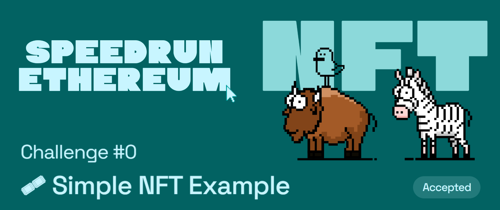

# Challenge #0: 🎟 Simple NFT Example

## Tasks to be done

🎫 Create a simple NFT to learn basics of 🏗 scaffold-eth. You'll use 👷‍♀️ [HardHat](https://hardhat.org/getting-started/) to compile and deploy smart contracts. Then, you'll use a template React app full of important Ethereum components and hooks. Finally, you'll deploy an NFT to a public network to share with friends! 🚀

🌟 The final deliverable is an app that lets users purchase and transfer NFTs. Deploy your contracts to a testnet then build and upload your app to a public web server.

## My Review

I would not class this as a challenge but more like getting accustomed with the setup and tools being used. For beginers in web3, this is a great way to understand how smart contracts are written, compiled, tested and deployed 🚀 Beginers should use this challenge to experiment and practice writing solidity which they might have learned recently but if you have written smart contracts in the past you can get used to the setup and quickly move on to the next challenge.

## Important links

- [Speed Run Ethereum](https://speedrunethereum.com/challenge/simple-nft-example)
- [Deployed webapp](https://kevinj-sre-c0.surge.sh/)
- [Deployed contract](https://goerli.etherscan.io/address/0xd3628c08de1a2788c232732bb06de8dbdae1a3e7)
- [Dev.to article](https://dev.to/kevinjoshi46b/challenge-0-simple-nft-example-1c43)
