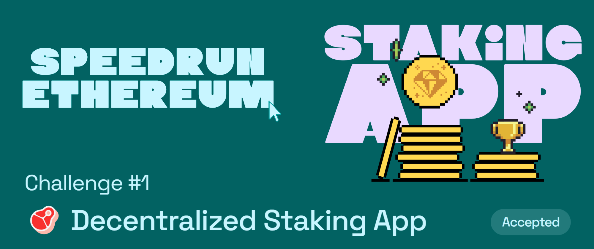

# Challenge #1: 🥩 Decentralized Staking App

## Tasks to be done

🦸 A superpower of Ethereum is allowing you, the builder, to create a simple set of rules that an adversarial group of players can use to work together. In this challenge, you create a decentralized application where users can coordinate a group funding effort. If the users cooperate, the money is collected in a second smart contract. If they defect, the worst that can happen is everyone gets their money back. The users only have to trust the code.

## My Review

This challenge was fun, I got to work with `interacting with external contracts`, creating and emiting `events`, setting `contructor`, creating and using `modifiers`, setting up a `time relative system`, `payable functions` and the `special function receive`. This challenge felt more like a CP (competitive programming) problem statement where a story / situation is explained and we need to write the code for the situation. This challenge is great for beginners since it teaches you about things like event, modifiers and much more which is at the core of solidity 🎯

## Important links

- [Speed Run Ethereum](https://speedrunethereum.com/challenge/decentralized-staking)
- [Deployed webapp](https://kevinj-sre-c1.surge.sh/)
- [Deployed contract](https://goerli.etherscan.io/address/0x71e41994f258bfce08cd455e6cc58fb7121902f6)
- [Dev.to article](https://dev.to/kevinjoshi46b/challenge-1-decentralized-staking-app-3l8l)
