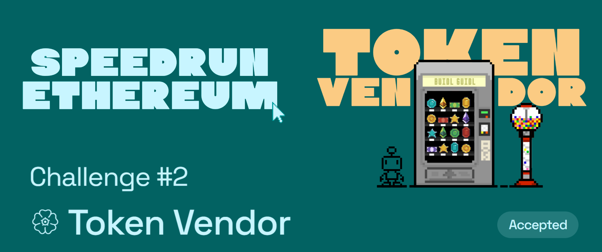

# Challenge #2: 🏵 Token Vendor

## Tasks to be done

🤖 Smart contracts are kind of like "always on" *vending machines* that **anyone** can access. Let's make a decentralized, digital currency. Then, let's build an unstoppable vending machine that will buy and sell the currency.

## My Review

This was a fun challenge because I got to create my own crypto [KevinCoin](https://goerli.etherscan.io/token/0xccdba9c461ffe52b480e2899975ead2341ff70b1) which is priced at 0.01 ETH 😎 (on a testnet 🫠) This challenge essentially teaches you about the ERC 20 standards and how it works, its mechanism of approve, why it exists and so much more...

## Important links

- [Speed Run Ethereum](https://speedrunethereum.com/challenge/token-vendor)
- [Deployed webapp](https://kevinj-sre-c2.surge.sh/)
- [Deployed contract](https://goerli.etherscan.io/address/0x84ab81388e155D697291300F4Ed0e493E988c513)
- [Dev.to article](https://dev.to/kevinjoshi46b/challenge-2-token-vendor-2565)
