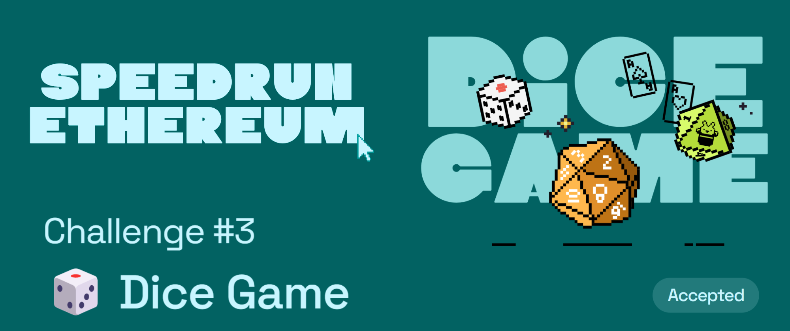

# Challenge #3: 🎲 Dice Game

## Tasks to be done

💬 Dice Game is a contract that allows users to roll the dice to try and win the prize.  If players roll either a 0, 1, or 2 they will win the current prize amount.  The initial prize is 10% of the contract's balance, which starts out at .05 Eth.  

🧤 Every time a player rolls the dice, they are required to send .002 Eth.  40 percent of this value is added to the current prize amount while the other 60 percent stays in the contract to fund future prizes.  Once a prize is won, the new prize amount is set to 10% of the total balance of the DiceGame contract.  

🧨 Your job is to attack the Dice Game contract!  You will create a new contract that will predict the randomness ahead of time and only roll the dice when you're guaranteed to be a winner!

## My Review

This was a fairly simple challenge where we just had to copy the dice roll calculation logic from the main contract and make sure that the function is only called if the user is about to win! VRF (verifiable random function) are something new that I got to learn about ✨ Looking forward to randomness someaday being build into the ethereum protocol ✊

## Important links

- [Speed Run Ethereum](https://speedrunethereum.com/challenge/dice-game)
- [Deployed webapp](https://kevinj-sre-c3.surge.sh/)
- [Deployed contract](https://goerli.etherscan.io/address/0x8b14c651DA326b42cFaCcA96b48507109E57173A)
- [Dev.to article](https://dev.to/kevinjoshi46b/challenge-3-dice-game-16lb)
