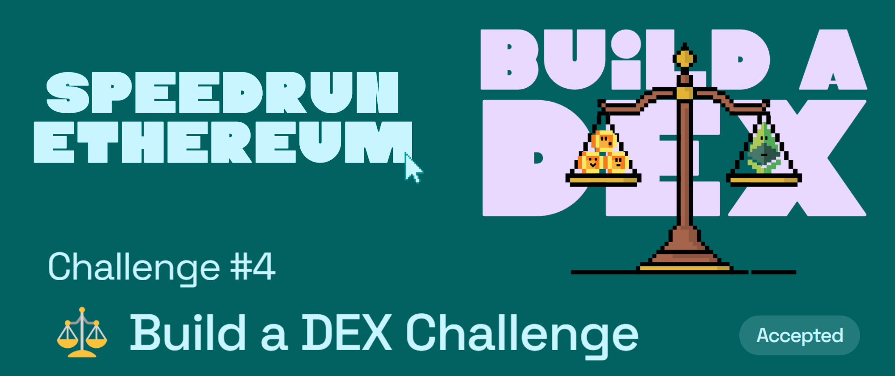

# Challenge #4: ⚖️ Build a DEX Challenge

## Tasks to be done

This challenge will help you build/understand a simple decentralized exchange, with one token-pair (ERC20 BALLOONS ($BAL) and ETH).

## My Review

This was a very interesting challenge, although most of the code was pre provided this challenge helped me understand how DEXs work. Such a simple mathematical formula that makes sure that the liquidity pool never empties and also balances the cost of the tokens based on the liquidity available ⚖️ Also my first time using the SafeMath by openzeppelin 📈

## Important links

- [Speed Run Ethereum](https://speedrunethereum.com/challenge/minimum-viable-exchange)
- [Deployed webapp](https://kevinj-sre-c4.surge.sh/)
- [Deployed contract](https://goerli.etherscan.io/address/0xf8f64a21e78c8d5d5f9883Cc76Ad38848333f3d5)
- [Dev.to article](https://dev.to/kevinjoshi46b/challenge-4-build-a-dex-challenge-2a55)
