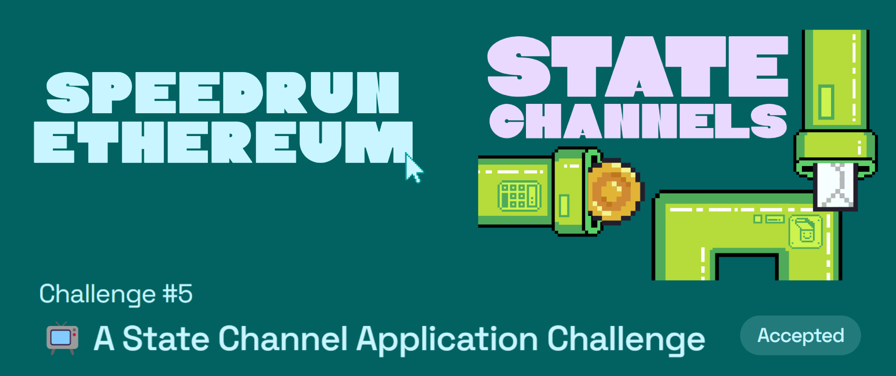

# Challenge #5: 📺 A State Channel Application Challenge

  

## Tasks to be done

🧑‍🤝‍🧑 State channels really excel as a scaling solution in cases where a fixed set of participants want to exchange value-for-service at high frequency. The canonical example is in file sharing or media streaming: the server exchanges chunks of a file in exchange for micropayments.

🧙 In our case, the service provider is a `Guru` who provides off-the-cuff wisdom to each client `Rube` through a one-way chat box. Each character of text that is delivered is expected to be compensated with a payment of `0.001 ETH`.

We will:

- 🛣️ Build a `Streamer.sol` contract that collects **ETH** from numerous client addresses using a payable `fundChannel()` function and keeps track of `balances`.
- 💵 Exchange paid services off-chain between the `Streamer.sol` contract owner (the **Guru**) and **rube** clients with funded channels. The **Guru** provides the service in exchange for signed vouchers which can later be redeemed on-chain.
- ⏱ Create a Challenge mechanism with a timeout, so that **rubes** are protected from a **Guru** who goes offline while funds are locked on-chain (either by accident, or as a theft attempt).
- ⁉ Consider some security / usability holes in the current design.

## My Review

This challenge helps you dive into layer 2 solutions in blockchain ⛓️ State channels is one of the solutions but I also got to explore and learn more about rollups (ZK Rollup and Optimistic rollups). I also learned how to verify a message singature on chain using ecrecover function as well as I explored the openzeppelin's [ECDSA library](https://docs.openzeppelin.com/contracts/4.x/utilities#cryptography) 🔍 It also made me explore Broadcast channels in js since, I spend hours understanding why my messages aren't being sent via the channel when I had the second tab open in incognito (messages only pass in the same window!) 🙂

## Important links

- [Speed Run Ethereum](https://speedrunethereum.com/challenge/state-channels)
- [Deployed webapp](https://kevinj-sre-c5.surge.sh/)
- [Deployed contract](https://goerli.etherscan.io/address/0xbDC4cB01b4469D56B7953389F9CB37Ab2BE686f9)
- [Dev.to article](https://dev.to/kevinjoshi46b/challenge-5-a-state-channel-application-challenge-5g7b)
