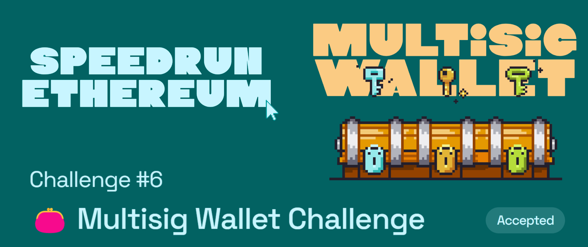

# Challenge #6: 👛 Multisig Wallet Challenge

  

## Tasks to be done

This is a smart contract that acts as an off-chain signature-based shared wallet amongst different signers that showcases use of meta-transaction knowledge and ECDSA `recover()`.

At a high-level, the contract core functions are carried out as follows:

**Off-chain: ⛓🙅🏻‍♂️** - Generation of a packed hash (bytes32) for a function call with specific parameters through a public view function . - It is signed by one of the signers associated to the multisig, and added to an array of signatures (`bytes[] memory signatures`)

**On-Chain: ⛓🙆🏻‍♂️**

- `bytes[] memory signatures` is then passed into `executeTransaction` as well as the necessary info to use `recover()` to obtain the public address that ought to line up with one of the signers of the wallet.
  - This method, plus some conditional logic to avoid any duplicate entries from a single signer, is how votes for a specific transaction (hashed tx) are assessed.
- If it's a success, the tx is passed to the `call(){}` function of the deployed MetaMultiSigWallet contract (this contract), thereby passing the `onlySelf` modifier for any possible calls to internal txs such as (`addSigner()`,`removeSigner()`,`transferFunds()`,`updateSignaturesRequried()`).

## My Review

This challenge didn't really have any or much code to write, it was more about reading and understanding the code as well as self exploring the topics 🤓 At the core of this challenge is understanding `meta transactions`. Understanding meta transactions was very interesting and cool since they can be used in so many different ways, opening doors for many applications to be possible, one example being multisig wallet. The fact that you can pass a function inside a call data and then the contract can then call that function is so cool 🤌

## Important links

- [Speed Run Ethereum](https://github.com/scaffold-eth/scaffold-eth-challenges/tree/challenge-5-multisig)
- [Deployed webapp](https://kevinj-sre-c6.surge.sh/)
- [Deployed contract](https://goerli.etherscan.io/address/0xc45FEd4ebc8492b0E8997fB03Bc8D3183bF7B6f4)
- [Dev.to article](https://dev.to/kevinjoshi46b/challenge-6-multisig-wallet-challenge-3aaf)
