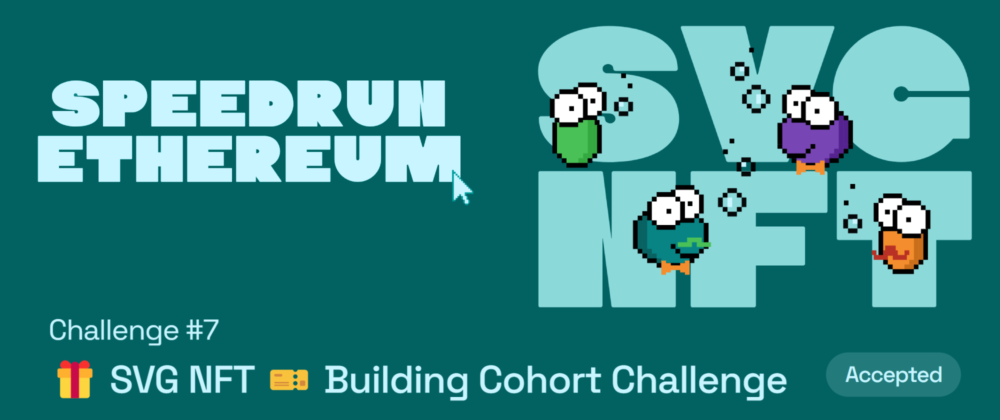

# Challenge #7: 🎁 SVG NFT 🎫 Building Cohort Challenge

## Tasks to be done

Build a svg NFT of your own!

## My Review

This is a very cool challenge since you get to learn about SVG NFTs. SVG NFTs are great since all the data related to the NFT is stored on the blockchain ⛓️ itself and there is no need of IPFS but its equally a bit costly since the data is being stored on the blockchain. This triggers a thought that maybe even normal images can be stored on blockchain itself, maybe in byte strings 🤔 but will probably end up being too costly! 💸  

You can checkout my own implementation of SVG NFTs, Pinocchio Loogies a collection of 10 special edition loogies where with every mint the length of the nose shrinks by 10%. Feel free to mint some if there are any left 💪

## Important links

- [Speed Run Ethereum](https://github.com/scaffold-eth/scaffold-eth-examples/tree/loogies-svg-nft)
- [Deployed contract](https://polygonscan.com/address/0xd3628c08de1a2788c232732bb06de8dbdae1a3e7)
- [Deployed webapp for minting]()
- [Opensea collection](https://opensea.io/collection/pinocchio-loogies)
- [Dev.to article]()
